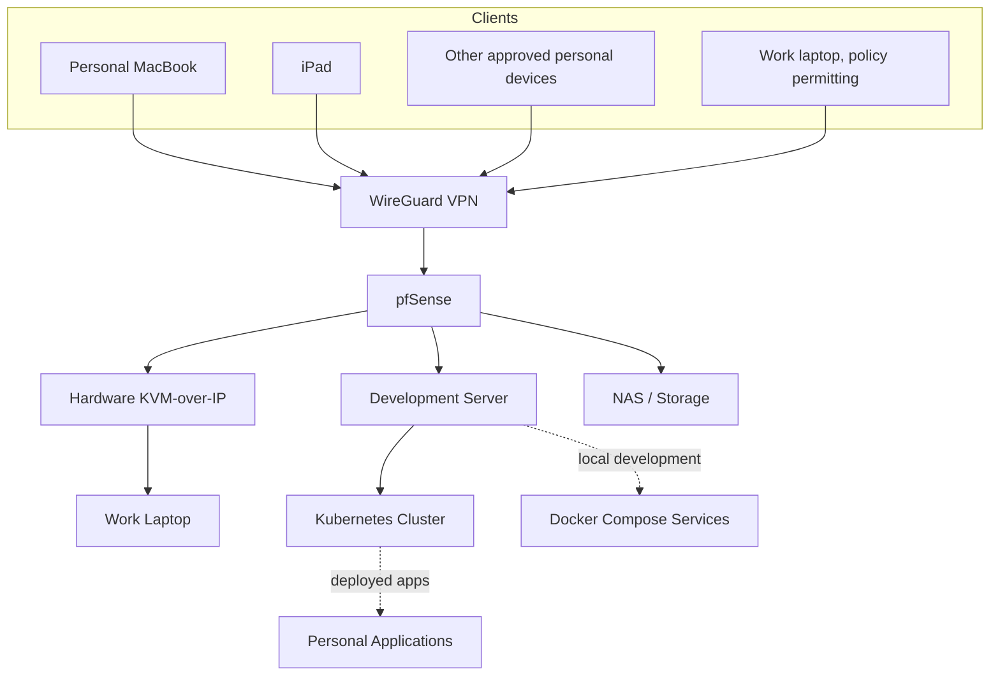
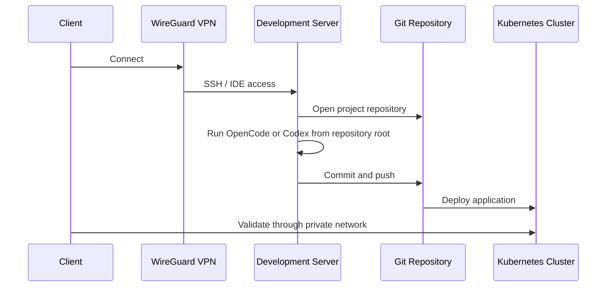

# Home Engineering Platform Architecture

## 1. Purpose

This document is the canonical architecture for the personal home engineering platform. It supersedes earlier single-server infrastructure plans while preserving all non-conflicting security, access, development, backup, and operations requirements.

The platform is designed to provide:

- A persistent personal development workstation reachable from approved devices.
- Secure remote access through a private VPN.
- Browser-based and SSH-based development workflows.
- Support for Java, Angular, TypeScript, Python, Docker, and AI coding tools.
- A separate Kubernetes deployment target for long-running personal applications.
- Secure VPN-only access to a hardware KVM connected to a work laptop, where use complies with employer policy.
- Optional future local AI workloads using an NVIDIA RTX 2080 Super.

This is no longer a single "home development server" project. It is a personal engineering platform that mirrors the responsibility boundaries of a small modern software organization.

## 2. Design Principles

- Each machine has one primary responsibility.
- No machine should serve multiple unrelated purposes.
- Development and deployment are separate concerns.
- The development server is a workstation, not a production-like hosting environment.
- Kubernetes is the deployment target, not the development environment.
- VPN is the only public entry point unless an exception is explicitly documented and approved.
- Internal services must not be exposed directly to the public internet.
- Terraform and Ansible responsibilities must remain separate.
- Repositories must remain independently understandable.
- Automation must be reproducible, auditable, and documented.
- Prefer simple solutions over unnecessary enterprise complexity.

## 3. Platform Overview



No SSH, KVM, database, IDE, AI, Docker, or Kubernetes service should be publicly exposed. The only externally reachable service should be the VPN endpoint, unless an explicit exception is documented and approved.

## 4. Physical and Logical Components

### 4.1 pfSense Router and Firewall

pfSense is the network control plane for the platform.

Responsibilities:

- Terminate WireGuard VPN.
- Enforce inbound default-deny firewall policy.
- Restrict VPN clients to approved LAN resources.
- Provide static DHCP reservations or local DNS entries for platform machines.
- Provide firewall aliases or rule groups for sensitive devices such as the KVM.
- Optionally support VLANs for management devices, KVM isolation, or future segmentation.

pfSense must not be modified automatically by Ansible. Any pfSense configuration automation must be reviewed as a separate future decision.

### 4.2 Development Server

The development server is the primary personal workstation.

Hardware:

- CPU: Intel Core i5-9700K.
- RAM: 32 GB.
- Optional GPU: NVIDIA RTX 2080 Super.
- Network: wired Ethernet preferred.
- Power: connected to UPS.

Operating system:

- Fedora Server is the canonical target for the current architecture.
- The system should use a predictable hostname, preferably `forge`.
- The local DNS name should use a non-mDNS suffix, preferably `forge.home.arpa`.
- Static DHCP reservation is preferred over hardcoded static host configuration.

Responsibilities:

- VS Code Remote SSH.
- IntelliJ Remote Development or JetBrains Gateway evaluation.
- AI coding agents such as OpenCode, Codex CLI when available and approved, and other terminal-based coding harnesses.
- Git repositories.
- Docker Compose for local development and temporary testing services.
- Local databases for development.
- Java, Angular, TypeScript, Python, Docker, and shell-based development.
- Optional local LLM experimentation after the base platform is stable.

Non-responsibilities:

- Hosting production-like long-running applications.
- Running the Kubernetes control plane unless explicitly assigned as a Kubernetes node in the separate cluster design.
- Exposing services directly to the public internet.
- Storing secrets in Git.

### 4.3 Kubernetes Cluster

The Kubernetes cluster is the deployment target for personal applications built on the development server.

Initial state:

- Single node.

Future state:

- Three-node cluster.
- Automation should be designed with future multi-node expansion in mind.

Responsibilities:

- Finance App.
- Health Tracker.
- Future personal applications.
- Internal APIs.
- Monitoring stack.
- Future ingress, secrets, storage, and GitOps workflows.

Non-responsibilities:

- General software development.
- Running local IDEs or coding agents.
- Replacing the development server.

Kubernetes is introduced only after the development platform is stable.

### 4.4 Hardware KVM-over-IP

The KVM is a sensitive management appliance connected to the work laptop through HDMI or DisplayPort and USB.

Responsibilities:

- Provide remote BIOS-level or OS-independent access to the work laptop.
- Remain independent from the work laptop operating system.
- Be reachable only from trusted LAN or VPN networks.

Requirements:

- Static LAN IP or DHCP reservation.
- VPN-only remote access.
- No direct WAN exposure.
- Strong unique password.
- Default credentials removed.
- Firmware kept current.
- HTTPS enabled if supported.
- UPnP disabled.
- Cloud relay disabled unless explicitly required and approved.
- Separate pfSense firewall alias or rule group.

The platform must not install remote-control software on the work laptop and must not attempt to bypass employer controls. KVM use must comply with employer security and remote-work policies.

### 4.5 NAS / Storage

NAS or other storage may be used for backups and recovery artifacts.

Responsibilities:

- Store backups of repositories, configuration exports, database dumps, and recovery material.
- Provide a secondary copy of important personal data.

The development server must not be the only copy of active source code.

## 5. Infrastructure Layers

### 5.1 Layer 1: Infrastructure

Owner: Terraform.

Responsibilities:

- AWS infrastructure.
- Future cloud resources.
- DNS.
- Networking.
- Cloud experimentation.
- Future resources such as EC2, Route53, IAM, S3, and RDS.

Terraform must not configure Fedora or manage operating system state.

### 5.2 Layer 2: Operating System Configuration

Owner: Ansible.

Responsibilities:

- Fedora Server provisioning.
- Kubernetes node provisioning.
- Package installation.
- Users.
- SSH hardening.
- Firewall configuration.
- Docker installation.
- Developer tooling.
- Optional NVIDIA support when the GPU phase begins.

Ansible owns machine configuration. Playbooks must be idempotent where practical and must not:

- Modify pfSense automatically.
- Store secrets in plaintext.
- Open public firewall ports.
- Install unapproved remote-control software.
- Configure Terraform-managed cloud infrastructure.

### 5.3 Layer 3: Platform Runtime

Owner: Docker Compose on the development server and Kubernetes on the cluster.

Docker Compose responsibilities:

- PostgreSQL for local development.
- Redis for local development.
- Local AI services after the base platform is stable.
- Temporary testing services.
- Optional browser IDE only when bound privately and authenticated.

Kubernetes responsibilities:

- Long-running deployed applications.
- Internal APIs.
- Monitoring and future platform services.

### 5.4 Layer 4: Applications

Owner: application repositories.

Examples:

- Finance App.
- Health Tracker.
- Future AI applications.

Applications must not directly configure infrastructure. They may include local development files such as `docker-compose.yml`, project-specific `.vscode/` settings, tests, and deployment manifests where appropriate.

## 6. Repository Model

Use four primary repositories instead of a single infrastructure repository.

### 6.1 `home-platform`

Purpose: architecture and planning source of truth.

Contains:

- Architecture documentation.
- Diagrams.
- Inventory documentation.
- Network documentation.
- Security documentation.
- Roadmaps.
- Operational checklists.

Does not contain:

- Executable Ansible configuration.
- Terraform configuration.
- Secrets.

### 6.2 `home-ansible`

Purpose: machine configuration.

Contains:

- Fedora roles.
- Kubernetes node roles.
- Docker installation.
- Developer workstation setup.
- SSH hardening.
- Firewall configuration.
- Verification scripts.
- Example inventory without secrets.

Does not contain:

- Terraform.
- pfSense automation.
- KVM automation.
- Secrets.

### 6.3 `home-terraform`

Purpose: cloud infrastructure.

Contains:

- AWS networking.
- Future EC2, Route53, IAM, S3, and RDS experiments.
- Cloud learning exercises.

Does not contain:

- Linux machine provisioning.
- Ansible roles.
- Application source code.
- Secrets.

### 6.4 Application Repositories

Example: `finance-app`.

Contains:

- `backend/`.
- `frontend/`.
- Project `docker-compose.yml` for local development.
- Project tests, tasks, and documentation.

Does not contain:

- Home platform automation.
- Cloud infrastructure ownership.
- Work source code.
- Employer information.

## 7. Network and Remote Access

### 7.1 VPN

Preferred implementation:

- WireGuard hosted on pfSense.

Alternative:

- Tailscale only if pfSense WireGuard proves unnecessarily difficult or unreliable.

Requirements:

- MacBook client support.
- iPad client support.
- Other approved personal device support.
- Individual client key revocation.
- Separate VPN subnet.
- Firewall rules allowing only required LAN access.
- Access to the development server.
- Access to the hardware KVM.
- No public exposure of internal services.

Example logical design:

```text
LAN: 192.168.10.0/24
VPN: 10.20.30.0/24
```

Actual subnets must be configurable and documented. Scripts must not hardcode network ranges without documentation.

### 7.2 SSH

Requirements:

- Public-key authentication only.
- Password authentication disabled after key access is verified.
- Root login disabled.
- Access allowed only from LAN and VPN subnets.
- Per-device SSH keys.
- Clear key revocation procedure.
- Optional fail2ban.

Example client configuration:

```text
Host forge
    HostName forge.home.arpa
    User sergey
    IdentityFile ~/.ssh/id_ed25519_forge
```

Private keys must never be stored in any platform repository.

### 7.3 Browser-Based Access

iPad and lightweight remote workflows may use browser-based development only when the service:

- Binds only to LAN, VPN, localhost, or a private interface.
- Requires authentication.
- Uses HTTPS where practical.
- Is never exposed directly to the public internet.

Preferred evaluation order:

1. VS Code tunnel.
2. Browser-based VS Code environment.
3. code-server behind VPN.
4. SSH terminal with tmux for small edits and AI harness usage.

The first implementation should choose the simplest secure option.

## 8. Development Workflows

### 8.1 Daily Workflow



Applications are developed on the development server and deployed to Kubernetes.

### 8.2 VS Code Remote SSH

Primary workflow:

```text
VS Code
  -> Remote SSH
  -> forge
  -> repository root
```

VS Code should open the application repository root.

Project-specific VS Code configuration may be stored in each application repository:

```text
.vscode/
├── settings.json
├── extensions.json
├── tasks.json
└── launch.json
```

Personal editor preferences should use VS Code Settings Sync.

### 8.3 Java Development

For Java-heavy work:

- Prefer JetBrains Remote Development or Gateway.
- IntelliJ may run on the MacBook while opening the remote project backend.
- Remote-mounted filesystems should be used only after latency and file-watching behavior are tested.
- Java projects should prefer repository-owned wrappers such as `mvnw` and `gradlew`.

### 8.4 AI Coding Agents

Terminal-based AI coding tools should run from the repository root so they can inspect the complete project.

Examples:

```bash
cd ~/projects/finance-app
opencode
```

Supported tools may include:

- OpenCode.
- Codex CLI, when available and approved.
- Other CLI-based coding agents.

Credentials and API keys must be stored outside Git.

### 8.5 tmux Sessions

The platform must support disconnect-resilient terminal workflows. A tmux session should be resumable after disconnecting from an iPad or MacBook.

## 9. Development Toolchain

The development server should support the following tooling.

Core tools:

- Git.
- GitHub CLI.
- curl.
- wget.
- jq.
- unzip.
- tmux.
- neovim.
- build tools for native compilation.
- Docker Engine.
- Docker Compose plugin.
- OpenSSH server.

Java:

- Java 21 LTS.
- Maven.
- Gradle through repository wrappers.
- Optional SDKMAN for managing Java versions.

Node and TypeScript:

- Node.js LTS.
- npm.
- corepack.
- pnpm support.
- Angular CLI as a project-local dependency where practical.

Projects should pin Node package manager versions using one or more of:

- `.nvmrc`.
- `.node-version`.
- `packageManager` in `package.json`.

Python:

- Python 3.
- uv.
- Virtual environments.
- Ruff.
- pytest.

Avoid globally installing large numbers of Python packages.

## 10. Docker Compose Services

Initial Docker Compose services on the development server should remain minimal.

Recommended services:

- PostgreSQL.
- Redis.
- Optional admin UI only if needed.
- Optional code-server or browser IDE only behind VPN.
- Optional monitoring after core workflows are stable.

Do not install Kafka, Kubernetes, vector databases, or local LLM services in early development-server phases.

Service boundaries:

- PostgreSQL should be accessible only from the server and approved VPN paths.
- Redis should be accessible only from a server-local Docker network unless explicitly needed otherwise.
- code-server or browser IDEs must be accessible only from LAN/VPN and must require authentication.

Use named volumes. Store environment variables in local `.env` files ignored by Git. Commit `.env.example` files with placeholder values only.

## 11. GPU and Local AI

GPU and local AI support are optional and should begin only after the base development platform is stable.

Requirements:

- NVIDIA driver compatible with RTX 2080 Super.
- NVIDIA Container Toolkit.
- Docker GPU verification.
- Optional Ollama installation.
- Optional embedding model support.

Verification:

```bash
nvidia-smi
```

Container verification must confirm that the GPU is visible inside Docker.

AI services must not be publicly exposed. Bind them only to:

- localhost.
- Docker private networks.
- LAN/VPN where explicitly required and documented.

Vector databases are part of the later AI platform phase, not the initial development-server phase.

## 12. Security Requirements

Mandatory controls:

- No public SSH.
- No public KVM.
- No public code-server or browser IDE.
- No public database ports.
- No public AI endpoints.
- VPN-only administrative access.
- SSH keys only.
- Root SSH disabled.
- Automatic security updates.
- Time synchronization.
- Host firewall enabled.
- Default-deny inbound posture.
- Minimal installed services.
- Regular patching.
- Secrets separated from configuration.
- Logs available for review.
- Backups of configuration.
- Per-device credential revocation.

Optional controls:

- fail2ban.
- VLAN for management devices.
- VLAN for KVM.
- MFA where supported.
- SSH certificate authority.
- Centralized logs.
- Intrusion detection on pfSense.

Never commit:

- Passwords.
- Private keys.
- VPN private keys.
- API tokens.
- Employer information.
- Work source code.
- Personal production data.

## 13. Backup and Recovery

Back up:

- `home-platform`.
- `home-ansible` inventory without secrets.
- `home-terraform` state according to Terraform best practices.
- Docker Compose files.
- Database dumps.
- Shell configuration.
- VS Code project settings.
- Important project repositories.
- pfSense configuration export.
- KVM configuration documentation.
- Kubernetes manifests and cluster recovery documentation when Kubernetes exists.

Do not depend on the development server as the only copy of source code. Active projects must be pushed to remote Git repositories.

Recommended backup targets:

1. GitHub or another Git remote.
2. Synology NAS or equivalent local storage.
3. Optional encrypted off-site backup.

Recovery procedure:

```text
Install Fedora Server
-> Restore SSH access
-> Clone home-platform for documentation
-> Clone home-ansible
-> Run Ansible for machine configuration
-> Restore Docker volumes or database dumps
-> Clone application repositories
-> Restore Kubernetes cluster when applicable
-> Verify remote development access
-> Verify deployment workflow
```

Recovery documentation must be tested at least once.

## 14. Monitoring and Maintenance

Health checks should verify:

- Disk usage.
- Memory usage.
- CPU load.
- Docker status.
- Failed systemd services.
- SSH service.
- PostgreSQL status when enabled.
- VPN reachability assumptions.
- GPU status when installed.
- Available security updates.
- Kubernetes node and workload health when Kubernetes exists.

Monthly maintenance checklist:

- Apply updates.
- Reboot if required.
- Verify backups.
- Review disk usage.
- Review failed login attempts.
- Update KVM firmware if available.
- Confirm VPN client keys.
- Remove unused accounts and keys.
- Test recovery documentation.
- Review Kubernetes health after the cluster phase begins.

## 15. Implementation Roadmap

Implementation proceeds one phase at a time, with review before beginning the next phase.

### Phase 1: Fedora Development Server

- Install Fedora Server.
- Configure hostname and local DNS or DHCP reservation.
- Create non-root administrative user.
- Configure SSH keys.
- Harden SSH.
- Enable host firewall.
- Enable automatic security updates where appropriate for Fedora.
- Install Git, Docker, Java, Node, Python, tmux, Neovim, and core development tools.
- Configure VS Code Remote SSH.
- Validate Docker Compose locally.

### Phase 2: Ansible Automation

- Create `home-ansible`.
- Provision Fedora repeatably.
- Automate package installation.
- Automate SSH hardening.
- Automate Docker and developer tooling setup.
- Provide manual fallback documentation.
- Provide validation commands for each completed step.

### Phase 3: Application Development Workflow

- Establish `finance-app`.
- Support Java backend development.
- Support Angular and TypeScript frontend development.
- Support Python tooling.
- Support Docker Compose local dependencies.
- Configure OpenCode or Codex usage from repository root.
- Configure GitHub CLI.

### Phase 4: Terraform and Cloud Learning

- Create `home-terraform`.
- Keep Terraform separate from Ansible.
- Begin with small AWS networking and infrastructure exercises.
- Document state handling and secret boundaries.

### Phase 5: Kubernetes Deployment Platform

- Introduce single-node Kubernetes.
- Deploy personal applications.
- Add ingress, secrets, storage, and GitOps only when needed.
- Design automation for future three-node expansion.

### Phase 6: Observability

- Add Prometheus.
- Add Grafana.
- Add logging.
- Add tracing where useful.

### Phase 7: AI Platform

- Install optional GPU support.
- Install optional Ollama.
- Test small local models.
- Add embedding models.
- Evaluate vector database needs.
- Develop agent workflows.
- Keep all AI endpoints private.

### Cross-Cutting: VPN, iPad, KVM, and Recovery

These capabilities may be introduced when needed, but must preserve the architecture boundaries:

- WireGuard on pfSense for VPN.
- iPad workflow through VPN-only SSH, tmux, or browser IDE.
- KVM access through VPN-only firewall rules.
- Backup and recovery documentation across all repositories.

## 16. Acceptance Criteria

The platform is complete when all applicable criteria are true:

1. The development server can be reached by SSH from the MacBook over the home LAN.
2. The development server can be reached by SSH from the MacBook over VPN outside the home.
3. The development server can be reached from the iPad over VPN.
4. VS Code Remote SSH opens an application repository on the development server.
5. Java 21, Maven, Node LTS, Angular tooling, Python, uv, Docker, and Git work on the development server.
6. OpenCode or an approved AI coding agent can be launched from an application repository root.
7. PostgreSQL can run through Docker Compose for local development.
8. No SSH, KVM, database, AI, IDE, Kubernetes, or internal application ports are publicly exposed.
9. The hardware KVM is accessible through VPN.
10. The hardware KVM is inaccessible from the public internet.
11. Platform architecture and security are documented in `home-platform`.
12. Core server setup can be reproduced using Ansible in `home-ansible`.
13. Terraform, when introduced, remains isolated in `home-terraform`.
14. Applications are developed on the development server and deployed to Kubernetes.
15. Backups and recovery steps are documented and tested at least once.
16. The development server survives reboot and required services return automatically.
17. A tmux session can be resumed after disconnecting from an iPad or MacBook.
18. Kubernetes can run deployed personal applications after the Kubernetes phase is complete.

## 17. Superseded Decisions

The following earlier decisions are superseded by this canonical architecture:

- The platform is not a single `home-dev-infrastructure` repository. It uses separate `home-platform`, `home-ansible`, `home-terraform`, and application repositories.
- Ubuntu Server LTS is no longer the initial target for the development server. Fedora Server is canonical.
- The development server is not the deployment environment. Kubernetes is the deployment target.
- Terraform is not used for operating system configuration.
- Ansible is not used for cloud infrastructure ownership.
- Kubernetes, vector databases, and local LLM services are not part of the initial development-server setup.

