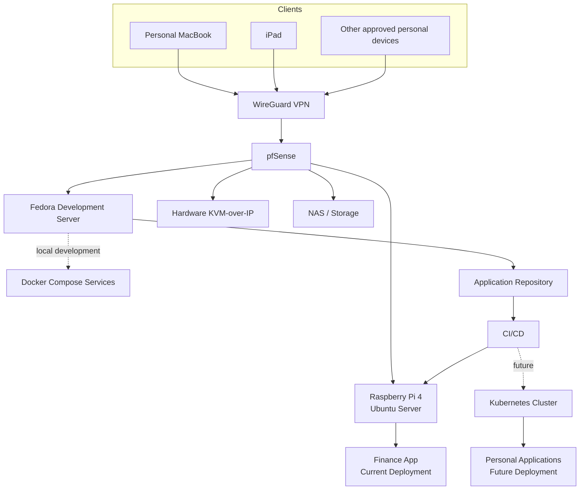

# Current Deployment Architecture

## Status

Accepted architecture update.

This document supplements `docs/architecture.md` and supersedes conflicting statements about the current application deployment target. The canonical architecture should be consolidated with this update during the next documentation refactor.

## Current State

The Finance App is currently hosted on a Raspberry Pi 4 with 8 GB RAM running Ubuntu Server. Deployment is performed manually through SSH.

The Raspberry Pi is an existing, active deployment target and is now an official component of the home engineering platform.



## Raspberry Pi Deployment Server

### Hardware and operating system

- Raspberry Pi 4.
- 8 GB RAM.
- Ubuntu Server.

### Responsibilities

- Host stable versions of personal applications.
- Serve as the current deployment target for the Finance App.
- Provide a practical environment for learning deployment automation before Kubernetes adoption.
- Validate container packaging, release procedures, health checks, rollback, backup, and recovery workflows.

### Non-responsibilities

- General software development.
- AI experimentation.
- Primary infrastructure automation control.
- Kubernetes control plane, unless explicitly repurposed later.

### Security requirements

- Administrative access must be restricted to trusted LAN and VPN networks.
- SSH must not be exposed directly to the public internet.
- Public application access, if required, must be handled separately from administrative access and documented explicitly.
- Secrets must remain outside Git.
- The server must be backed up and have a documented recovery procedure.

## Deployment Lifecycle

### Current lifecycle

```text
Developer
-> Git repository
-> Manual SSH deployment
-> Raspberry Pi
-> Finance App
```

### Next lifecycle

```text
Developer
-> Git repository
-> CI validation
-> Automated deployment
-> Raspberry Pi
-> Health verification
-> Rollback when required
```

### Future lifecycle

```text
Developer
-> Git repository
-> CI validation
-> GitOps or deployment automation
-> Kubernetes
-> Health verification and observability
```

The Raspberry Pi remains the current stable deployment target while Kubernetes is a future primary deployment platform.

## Application-Owned Deployment

Application repositories own their deployment artifacts. For the Finance App, the `finance-app` repository should contain, as needed:

- GitHub Actions workflows.
- Docker images and container build definitions.
- Docker Compose configuration for local development and Raspberry Pi deployment.
- Deployment and rollback scripts.
- Kubernetes manifests or Helm charts when Kubernetes is introduced.
- Release and operational documentation.

Platform repositories must not contain application-specific deployment logic:

- `home-platform` owns architecture, decisions, and planning.
- `home-ansible` owns machine configuration.
- `home-terraform` owns cloud infrastructure.
- `finance-app` owns its source, build, release, and deployment configuration.

A separate Finance App deployment repository is not required.

## Roadmap Adjustment

The implementation roadmap is adjusted as follows:

1. Fedora development server.
2. Ansible automation.
3. Application development workflow.
4. Raspberry Pi deployment automation and CI/CD.
5. Terraform and AWS learning.
6. Kubernetes deployment platform.
7. Observability.
8. AI platform.

The Raspberry Pi phase should include:

- Documenting the existing manual deployment.
- Containerizing deployment consistently if not already complete.
- Adding CI checks.
- Automating deployment without exposing SSH publicly.
- Adding health verification.
- Adding a tested rollback procedure.
- Documenting backups and recovery.

## Future Role of the Raspberry Pi

After Kubernetes becomes the primary deployment platform, the Raspberry Pi may remain useful as:

- A backup deployment target.
- An edge node.
- A monitoring node.
- A lightweight infrastructure service host.
- A Kubernetes worker, only if this is technically and operationally justified.

Repurposing it requires a separate architecture decision.