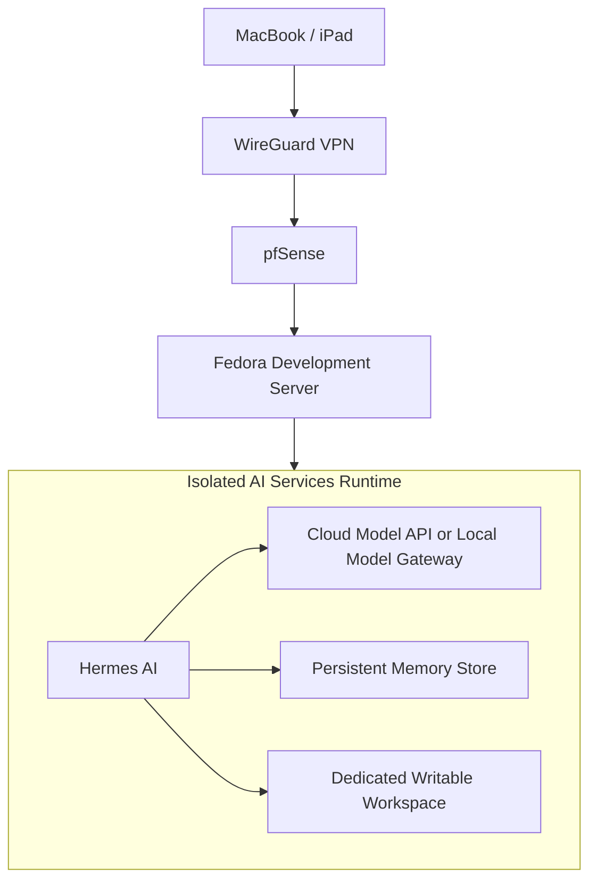

# Hermes AI Platform Architecture

## Status

Planned capability. Hermes AI is not part of the initial Fedora development-server installation and must be introduced only after the platform has secure remote access, Docker, secrets handling, backups, and basic monitoring.

## Purpose

Hermes AI will provide a persistent personal AI-agent runtime inside the home engineering platform.

Initial goals:

- Run a private, self-hosted AI agent reachable from approved devices.
- Support low-risk personal automation and platform-assistance workflows.
- Allow cloud-hosted model APIs initially.
- Allow later experiments with local models on the NVIDIA RTX 2080 Super.
- Provide a controlled path from Docker Compose on the Fedora development server to Kubernetes when the service becomes stable.

Hermes AI is distinct from development-time coding assistants such as OpenCode and Codex. OpenCode and Codex run interactively inside project repositories. Hermes AI is a persistent platform service with memory, tools, scheduling, and potentially long-lived credentials.

## Placement

Initial placement:

Hermes AI should initially run through Docker Compose on the Fedora development server in a dedicated network and isolated runtime.

Future placement:

- Move Hermes AI to Kubernetes only after its configuration, storage, security controls, and operational behavior are stable.
- Keep its data, memory, and tool permissions portable enough to migrate without redesigning the service.

## Model Strategy

### Initial

Use an approved cloud model API.

This allows the platform to validate:

- Agent configuration.
- Tool behavior.
- Memory behavior.
- Scheduling.
- Cost controls.
- Security boundaries.

without coupling the first deployment to GPU drivers, local inference performance, or model-memory constraints.

### Future

Evaluate local models through a private model gateway after the RTX 2080 Super is installed and validated.

The RTX 2080 Super should initially be used for:

- Embeddings.
- Smaller quantized models.
- Lightweight inference experiments.
- AI engineering exercises.

Cloud and local providers should be replaceable behind a documented model-provider boundary.

## Security Model

Hermes AI must be treated as a privileged service account, not as a harmless chatbot.

Mandatory controls:

- Run as a dedicated non-root Linux user or rootless container.
- Do not mount the Docker socket.
- Do not grant unrestricted `sudo`.
- Do not provide personal SSH private keys.
- Do not provide GitHub administrator tokens.
- Do not provide AWS administrator credentials.
- Do not provide direct access to the hardware KVM or work laptop.
- Do not expose the Hermes UI or API publicly.
- Permit access only through LAN or WireGuard VPN.
- Use separate service credentials with the minimum required permissions.
- Mount configuration and reference data read-only where practical.
- Provide one explicit writable workspace.
- Store secrets outside Git.
- Back up persistent memory and configuration separately from secrets.
- Log tool invocations and administrative actions.

Human approval is required before Hermes AI may:

- Send email or messages.
- Push Git commits.
- Merge pull requests.
- Deploy applications.
- Modify infrastructure.
- Change firewall or VPN configuration.
- Perform destructive filesystem operations.
- Access or modify financial records.
- Execute purchases or other financial actions.

## Initial Scope

The first Hermes AI use case should be deliberately low risk:

> Review Project Forge documentation and prepare draft GitHub issues for missing tasks. Do not modify repositories, send messages, deploy software, or change infrastructure.

Suitable early workflows:

- Summarize home-lab health reports.
- Prepare draft GitHub issues.
- Draft release notes.
- Summarize logs.
- Report available dependency and security updates.
- Summarize deployment status.

Not permitted initially:

- Autonomous deployment.
- Autonomous infrastructure changes.
- Access to Finance App production data.
- Access to work systems.
- Access to the KVM.
- Autonomous communication with external people.

## Runtime Requirements

The initial Docker Compose deployment should provide:

- A dedicated container network.
- A persistent volume for memory and state.
- A dedicated writable workspace volume.
- Read-only configuration mounts where practical.
- Explicit environment-variable configuration.
- Secrets injected outside source control.
- Health checks.
- Restart policy.
- Resource limits where supported.
- Logs available to the platform monitoring stack.
- No public port bindings.

## Operational Requirements

Before enabling Hermes AI:

- WireGuard remote access must be working.
- Docker must be installed and managed reproducibly.
- Backup and restore procedures must exist.
- Secrets handling must be documented.
- Basic host monitoring must exist.
- The exact Hermes distribution, version, installation method, and upstream source must be pinned and documented.

Maintenance requirements:

- Review upstream releases before upgrading.
- Back up memory and configuration before upgrades.
- Test upgrades in an isolated environment.
- Review tool permissions quarterly.
- Rotate API keys regularly.
- Remove unused tools and credentials.
- Review scheduled tasks and persistent memory for unexpected entries.

## Roadmap Placement

Hermes AI is part of the AI Platform phase.

Recommended sequence:

1. Fedora development server.
2. Ansible configuration management.
3. Finance App development workflow.
4. CI/CD to Raspberry Pi.
5. Terraform and AWS learning.
6. Kubernetes deployment platform.
7. Observability.
8. AI platform foundation.
9. Hermes AI in an isolated Docker Compose runtime.
10. Optional migration of Hermes AI to Kubernetes.
11. Optional local-model integration.

## Acceptance Criteria

Hermes AI is considered safely introduced when:

1. It runs in an isolated non-root runtime.
2. It is reachable only through LAN or VPN.
3. No public ports expose its UI or API.
4. It has no Docker socket or unrestricted `sudo` access.
5. It uses dedicated least-privilege credentials.
6. It has no access to the work laptop or KVM.
7. Its memory and configuration are backed up.
8. Tool calls and administrative actions are logged.
9. High-impact actions require explicit human approval.
10. Its first production workflow is limited to low-risk documentation and reporting tasks.
