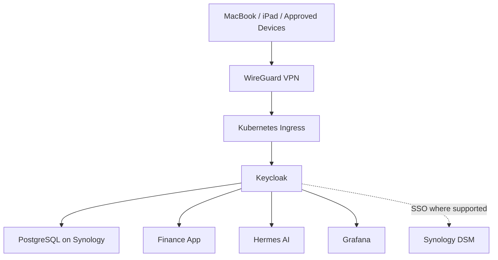

# Internal Identity and Access Architecture

## Status

Planned, deferred, medium-priority capability. The identity platform should be introduced after the Kubernetes deployment platform is stable and at least two applications or internal services are ready to use centralized authentication.

## Decision Summary

- Use Keycloak as the internal OpenID Connect and OAuth 2.0 identity provider.
- Run Keycloak on Kubernetes.
- Run its PostgreSQL database in a dedicated container on Synology.
- Keep critical recovery paths independent from Keycloak.
- Integrate applications gradually, beginning with the Finance App.

## Purpose

The identity platform will provide centralized authentication and authorization for personal applications and selected internal services.

Target capabilities:

- OpenID Connect login for browser and mobile applications.
- OAuth 2.0 access tokens for APIs.
- Users, groups, roles, and service accounts.
- Multi-factor authentication for administrative identities.
- Centralized access policies for Finance App, Health Tracker, Grafana, Hermes AI, and future services.
- Optional Synology DSM single sign-on where supported.

## Placement



Keycloak is a shared platform dependency and should not initially run on Forge as a temporary production service. Kubernetes provides the intended runtime, health management, secrets integration, and future scaling path.

## Synology PostgreSQL

The initial persistence strategy is a dedicated PostgreSQL container on Synology.

Requirements:

- Use a supported PostgreSQL version pinned in configuration.
- Create a dedicated `keycloak` database and least-privilege database role.
- Keep Keycloak and application databases logically separated.
- Restrict PostgreSQL network access to approved Kubernetes nodes and administrative paths.
- Do not expose PostgreSQL to the public internet.
- Use SCRAM authentication and TLS where practical.
- Back up with regular logical dumps in addition to storage snapshots.
- Test restoration before applications depend on Keycloak.

Example logical separation:

```text
PostgreSQL server on Synology
├── keycloak
│   └── role: keycloak_app
└── finance
    └── role: finance_app
```

This design separates identity compute from durable storage but does not provide high availability. Synology, the home network, PostgreSQL, and Kubernetes remain dependencies.

## Application Integration

Preferred application flow:

```text
Angular client
    -> Authorization Code Flow with PKCE
    -> Keycloak
    -> access token
    -> Spring Boot resource server
```

Initial role examples:

- `finance-user`
- `finance-readonly`
- `finance-admin`

Machine-to-machine access must use dedicated service accounts rather than personal user credentials.

## Synology Integration

The first Synology goal is centralized browser login to DSM where the installed DSM version and configuration support OIDC or SAML-based SSO.

Centralized DSM login does not automatically replace authentication for:

- SMB.
- NFS.
- SSH.
- WebDAV.
- Backup clients.
- Synology mobile applications.
- Package-specific services.

These protocols may continue using Synology-local accounts, directory services, or application-specific credentials.

A local Synology administrator account must always remain available for recovery.

## Security Boundaries

Mandatory controls:

- LAN and WireGuard-only access initially.
- HTTPS for all browser and token endpoints.
- MFA for Keycloak administrators.
- Separate normal and administrative accounts.
- No public user registration.
- Separate client registration and secrets for each application.
- Short-lived access tokens.
- Refresh-token rotation where supported.
- PKCE for browser and mobile clients.
- Secrets outside Git.
- Database and realm backups.
- Audit logging for administrative changes.

Keycloak must not become a dependency for:

- WireGuard access.
- pfSense administration.
- Emergency Synology administration.
- Kubernetes break-glass access.
- Database recovery.
- Core backup restoration.

The identity provider must not become a locked door whose recovery key is stored behind that same door.

## Rollout Order

1. Deploy Keycloak and PostgreSQL connectivity without application dependencies.
2. Configure administrator MFA and break-glass procedures.
3. Back up and restore the database and realm configuration.
4. Integrate a disposable test application.
5. Integrate the Finance App.
6. Integrate selected internal services such as Grafana and Hermes AI.
7. Evaluate Synology DSM SSO while retaining local recovery accounts.
8. Add an authentication-aware reverse proxy for services without native OIDC support only when necessary.

## Roadmap Placement

Keycloak follows Kubernetes and comes after the initial Hermes AI deployment.

The intended sequence is:

```text
Forge and Ansible
-> Finance App workflow
-> Raspberry Pi CI/CD
-> backups and basic monitoring
-> Hermes AI on Forge
-> Terraform and AWS learning
-> Kubernetes
-> Keycloak with PostgreSQL on Synology
-> broader observability and service integration
```

The active implementation sequence is maintained in `docs/roadmap.md`.

## Acceptance Criteria

The identity platform is ready for application use when:

1. Keycloak runs on Kubernetes and is reachable only through approved private paths.
2. PostgreSQL runs on Synology with a dedicated database and least-privilege role.
3. HTTPS and administrator MFA are enabled.
4. Database and realm restore procedures have been tested.
5. A test application completes OIDC Authorization Code Flow with PKCE.
6. A backend API validates access tokens and roles.
7. Local break-glass accounts exist for Synology and critical infrastructure.
8. VPN and recovery access remain independent from Keycloak.
9. No identity endpoint or database port is directly exposed to the public internet.
